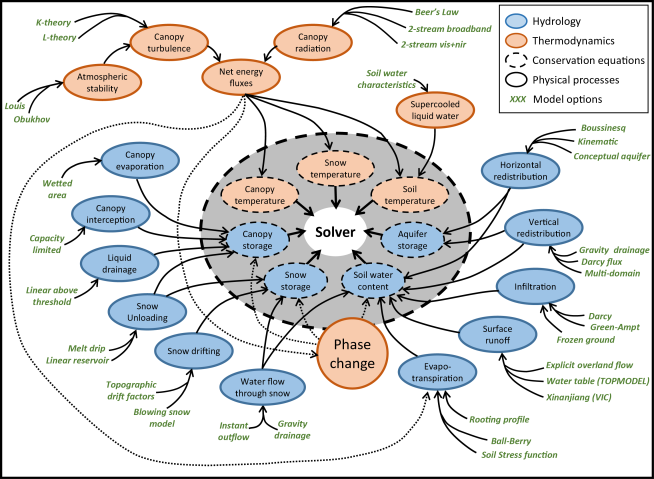
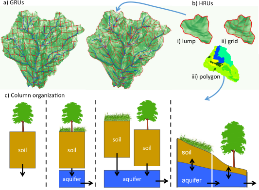

# SUMMA Configuration

SUMMA configuration is performed via a number of input files, which are described in detail in the documentation for [SUMMA input](../input_output/SUMMA_input.md). In this section we provide a brief overview of how SUMMA's configuration can be changed to evaluate multiple modeling alternatives. SUMMA provides opportunities to select how individual processes are parameterized and how the spatial model elements interact with each other. We'll discuss each of these in the following sections.

## Alternative model parameterizations

While most hydrologists have a common conceptualization of the dominant processes that contribute to the land surface hydrological cycle, there are many different ways in which these processes are parameterized in hydrological models. Because the implementation of these parameterizations is often intertwined with other aspects of hydrological models, it remains difficult in practice to directly compare the performance of these different model parameterizations.

In SUMMA, we have separated the model numerical solution techniques from the model parameterizations and we have made it possible to select from multiple parameterizations for individual hydrological processes, which allows for direct comparisons of these parameterizations under different conditions.

*SUMMA horrendogram (Clark et al. [2015a](../references.md#clark_2015a)) showing the SUMMA structure. The inner circle shows the conservation equations, which are solved by the solver. These conservations equations evolve in time as a result of physical processes, represented by the blue and orange circles. Each of these physical processes can be represented by different model parameterizations, which are shown in green and which can be specified as model options.*

The different model options are referred to as **model decisions** and are specified in the [model decisions file](../input_output/SUMMA_input.md#infile_model_decisions). SUMMA users can specify model decisions that they would like to use in this file by selecting from existing parameterizations. For example, the user can choose between three different parameterizations for vegetation roughness length and displacement height and two parameterizations that describe the change in saturated hydraulic conductivity with depth. The available model decisions are discussed in the [model decisions file](../input_output/SUMMA_input.md#infile_model_decisions), but the master list is available in the SUMMA model code in `summa/build/source/engine/mDecisions.f90` We envision that model developers will contribute additional model parameterizations for these and other processes. In the current version of SUMMA, the same parameterization applies across the entire model domain, that is, it is not possible to have different model decisions for different model elements. Also, in the current version users need to specify parameter values for all model decisions, even if they are not being used. However, the parameter values for parameters that are not active (because the active model decision does not require them) do not affect the simulation. This means that the user can provide dummy parameters for inactive model decisions.

## Alternative spatial configurations

In hydrological models we know that simulation results are affected by the spatial representation of the landscape in the model. In SUMMA we allow the user to combine model element in a number of different ways to expand the domain over which we can test multiple modeling alternatives.

The smallest spatial elements in SUMMA are **hydrologic response units** (HRUs), which can be organized into **grouped response units**. For a detailed listing of the important differences between these units, see Clark et al. ([2015a](../references.md#clark_2015a)). In brief, GRUs are made up of one or more HRUs, are spatially contiguous, and there is no lateral exchange of moisture between GRUs. HRUs do not have to be spatially continuous, for example, they can be used to represent fractional coverage of a single landscape type across the GRU, they are uniform in soil and land use type, and SUMMA includes an option for lateral subsurface flow between HRUs. HRUs can be configured as free-draining columns, as columns contributing to a conceptual aquifer, either individually or as a group, or as columns that exchange moisture with neighboring columns through the saturated subsurface. SUMMA does not dictate or presume a shape of HRUs and GRUs.

*Alternative SUMMA spatial configurations (Clark et al. [2015a](../references.md#clark_2015a)). One or more HRUs are organized into GRUs and HRUs can be configured as different column models.*

As with the model decisions, the column specification is set globally for the entire model domain. The specific column configuration can be selected in the [model decisions file](../input_output/SUMMA_input.md#infile_model_decisions). Whether the columns contribute to a single or common aquifer per GRU is indicated by the choice of the `spatial_gw` decision in that file. Spatial exchange between HRUs is indicated by specifying the downslope HRU in the [local attributes file](../input_output/SUMMA_input.md#infile_local_attributes).
