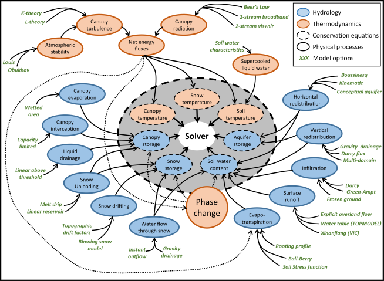
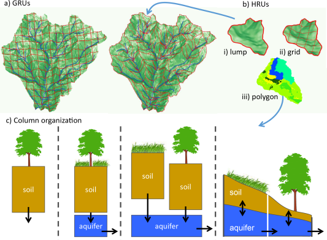

# SUMMA Configuration

SUMMA is configured through a set of input files, described in detail in the documentation for
[SUMMA input](../input_output/SUMMA_input.md). This section gives a high-level overview of the
three axes along which a SUMMA configuration can be varied: the **process parameterizations**,
the **numerical solution**, and the **spatial configuration**.

## Alternative process parameterizations

Most hydrologists share a common conceptual picture of the dominant land-surface hydrological
processes, but there are many different ways to parameterize those processes in a model, and
in most models the parameterizations are entangled with each other and with the numerical
solver. SUMMA separates the numerical solution from the process parameterizations and lets
you pick, independently, how each process is represented.

*SUMMA horrendogram (Clark et al. [2015a](../references.md#clark_2015a)). The inner circle is
the set of conservation equations solved by the numerical core. They evolve in time under the
physical processes shown in the blue and orange rings; each process can be represented by one
of several parameterizations (green), selected as model options.*

The parameterization choices are **model decisions**, listed in the
[model decisions file](../input_output/SUMMA_input.md#infile_model_decisions). The complete set
of decisions and their options is documented in
[Model Decisions in SUMMA](SUMMA_model_decisions.md); the file of record in the code is
`build/source/engine/mDecisions.f90`.

A few practical notes:

* A decision applies uniformly across the whole run — you cannot yet use different decisions
  for different model elements.
* Every decision must be given a value even if the active configuration does not use it.
  Where a decision is inactive, its value has no effect; several decisions accept the literal
  `notPopulatedYet` as a placeholder that resolves to the default.
* Parameters follow the same rule: values must be supplied for all parameters, but parameters
  that the active decisions do not use do not affect the simulation.

## Numerical solution

The conservation equations are solved by a numerical core that is independent of the process
parameterizations. The [`num_method`](SUMMA_model_decisions.md#num_method) decision selects the
solver:

* **homegrown** — SUMMA's built-in backward-Euler solver (also accepted under the legacy name
  `itertive`). Available in every build.
* **kinsol** — backward Euler using the SUNDIALS KINSOL nonlinear solver.
* **ida** — adaptive-step implicit differential-algebraic solution using SUNDIALS IDA.

The `kinsol` and `ida` options require SUMMA to be built with SUNDIALS support
(`cmake ... -DUSE_SUNDIALS=ON`, see the [installation instructions](../installation/SUMMA_installation.md)).
Related decisions include [`fDerivMeth`](SUMMA_model_decisions.md#fderivmeth) (numerical vs.
analytical Jacobian — analytical is required for the SUNDIALS solvers) and
[`nrgConserv`](SUMMA_model_decisions.md#nrgconserv), which chooses between a temperature-based
and an enthalpy-based form of the energy equations.

## Spatial configuration

Simulation results depend on how the landscape is discretized. SUMMA lets you combine model
elements in several ways so that multiple spatial configurations can be tested within the same
framework.

*Alternative SUMMA spatial configurations (Clark et al. [2015a](../references.md#clark_2015a)).
One or more HRUs are organized into GRUs, and HRUs can be configured as different column
models.*

### GRUs and HRUs

The two primary spatial units are the **grouped response unit** (GRU) and the **hydrologic
response unit** (HRU); see Clark et al. ([2015a](../references.md#clark_2015a)) for the full
discussion.

* A **GRU** is spatially contiguous and is made up of one or more HRUs. There is no lateral
  exchange of water between GRUs.
* An **HRU** is uniform in soil and land-use type and need not be spatially contiguous — for
  example, an HRU can represent the fractional coverage of one landscape type across the GRU.
  HRUs can be run as free-draining columns, as columns that feed a conceptual aquifer
  (individually or shared across the GRU), or as columns that exchange water with neighbouring
  columns through the saturated subsurface.

SUMMA does not presume any particular shape for HRUs or GRUs. The relevant decisions and
inputs are:

* [`groundwatr`](SUMMA_model_decisions.md#groundwatr) — the column type (TOPMODEL-style
  baseflow, big-bucket aquifer, or no explicit groundwater).
* [`spatial_gw`](SUMMA_model_decisions.md#spatial_gw) — whether each column has its own
  groundwater store (`localColumn`) or the GRU shares a single store (`singleBasin`).
* `downHRUindex` in the [local attributes file](../input_output/SUMMA_input.md#infile_local_attributes)
  — the downslope HRU for lateral subsurface exchange (`0` means the basin outlet, i.e. no
  downslope neighbour).

### Sub-HRU spatial domains

Within an HRU, SUMMA can carry more than one **spatial domain**, each with its own layered
column of state variables and its own fractional area of the HRU. The domain types are:

| Type | Status |
|---|---|
| upland | the standard soil/snow column; every HRU has one |
| glacier accumulation, glacier clean ablation, glacier debris ablation | glacier ice columns, with area that evolves over the run |
| wetland | recognized by the data structures but the wetland fluxes are not yet implemented |

Runs without glaciers or wetlands have exactly one (upland) domain per HRU and behave as in
earlier SUMMA versions. Domain counts, types, areas and initial layer structure come from the
[initial conditions file](../input_output/SUMMA_input.md#infile_initial_conditions). Lake
layers are represented in the layer bookkeeping alongside snow, soil and glacier ice, but a
full lake column is likewise not yet active.
