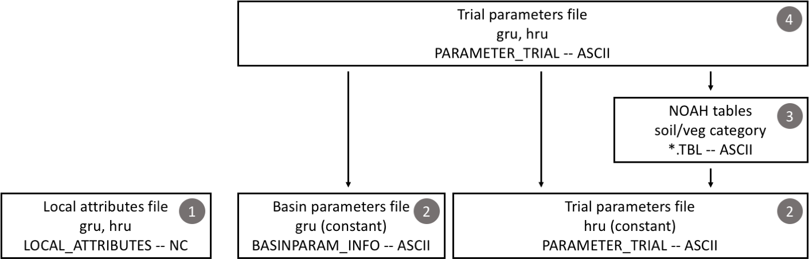

# SUMMA Input Files

SUMMA has a large number of input files that configure the model and provide the necessary initial conditions and time-varying boundary conditions to make a model simulation. This can at times be confusing. We encourage the user to look at the [SUMMA test cases](../installation/SUMMA_test_cases.md), which provide working SUMMA setups.

<a id="infile_file_formats"></a>
## Input file formats
SUMMA input files are either ASCII format or NetCDF. The general characteristics of these files are described in the next two subsections, while the contents of the individual input files are described after that.

<a id="infile_format_ASCII"></a>
### ASCII
ASCII or text files are in a format that can be modified using a text editor. Comments can be added to any SUMMA text file by starting the comments with  a `!`. Anything after the `!` will be discarded till the end of the line. You can include as many comments as you want, as they will be stripped as SUMMA processes the file.

<a id="infile_format_nc"></a>
### NetCDF
[NetCDF](https://www.unidata.ucar.edu/software/netcdf/) or Network Common Data Format is a file format that is widely used in geosciences to organize large data sets. The main advantages of using NetCDF files is that they are machine independent, they allow the user to include meta data directly in the data file, and they can be read by, visualized and analyzed using a large number of freely available software packages. The SUMMA documentation is not the place to learn about NetCDF. We assume that you know the difference between NetCDF dimensions, NetCDF variables, and NetCDF attributes (global and local). If you don't, then there are many tutorials available online. Note that NetCDF attributes are different from the local SUMMA attributes that we are describing [below](#infile_local_attributes).

SUMMA input files in NetCDF format can include variables (and dimensions) other than those specified below. They will simply not be read by SUMMA, but may be useful to facilitate further analysis and/or visualization. For example, it may be convenient to include latitude and longitude in many of the spatial files to allow visualization.

#### Note on GRU and HRU order in NetCDF files
SUMMA makes certain assumptions about GRU and HRU order in its input files, as determined in the `gruId` and `hruId` variables in these files. SUMMA expects the `gruId` and `hruId` variables to have identical orders in the forcing, attributes, coldState and trialParameter `.nc` files. Note that this is unrelated to the actual values of the `gruId` and `hruId` variables. In cases where each GRU contains exactly one HRU, no action is needed beyond ensuring that these files use the same order of IDs. In cases where a GRU contains multiple HRUs, SUMMA additionally expects that the HRUs inside a given GRU are found at subsequent indices in each NetCDF file (see table for an example of correct [left] and incorrect [right] order specification; `gruId` and `hruId` values set at arbitrary values to emphasize it is the order that matters, not the values themselves). 

| Index in file | gruId    | hruId | < correct <br> incorrect > | gruId     | hruId |
|---------------|----------|-------|:---------------------------|-----------|-------|
| 1             | 10       | 100   |                            | 10        | 100   |
| 2             | 10       | 300   |                            | 20        | 200   |
| 3             | 20       | 200   |                            | 10        | 300   |
| 4             | 20       | 400   |                            | 20        | 400   |

<a id="infile_master_configuration"></a>
## Master configuration file
The master configuration file is an [ASCII file](#infile_format_ASCII) and is provided to SUMMA at run-time as a command-line option. The path to this file needs to be supplied with the `-m` or `--master` command-line flag. The contents of this file orchestrate the remainder of the SUMMA run and are processed by the code in `build/source/hookup/summaFileManager.f90`. The file contents mostly consist of file paths that provide the actual information about the model configuration.  It also contains the run period and forcing time zone information.

The following items must be provided in the master configuration file. Order is not important, as the entries are each associated with a keyword.  Each keyword and entry pair must be on its own line, but may be followed by a comment (started by the '!' character), and you can add lines of comments between the items. Each entry must be enclosed in single quotes `'entry'`. The associations of the keywords to the actual variable name that is used in the SUMMA source code can be found in `summaFileManager.f90`, along with its default value where appropriate.

`controlVersion`: Version of the file manager that should be used to process the master configuration file. At this time, this string should be equal to `'SUMMA_FILE_MANAGER_V3.0.0'`.  Note, this version of the code is not backward compatible with versions using `SUMMA_FILE_MANAGER_V1.0` or `SUMMA_FILE_MANAGER_V2.0`.

`simStartTime`       : Start of the simulation specified as `'YYYY-MM-DD hh:mm'`. See [Time definition notes](#simulStartEndTimes).
`simEndTime`         : End of the simulation specified as `'YYYY-MM-DD hh:mm'`.
`tmZoneInfo`         : [Time zone information](#tmZoneInfo).
`settingsPath`       : Base path for the configuration files. Most of the file paths in the remainder of the master configuration file are relative to this path (except `forcingPath` and `outputPath`).
`forcingPath`        : Base path for the meteorological forcing files specified in the `forcingList`.
`outputPath`         : Base path for the SUMMA output files.
`statePath`          : (optional) Base path for the SUMMA state files, including the initial condition file.  If not given, the initial condition (state) file is read from the settingsPath directory, and the state file outputs are written to the outputPath directory.  If given, summa expects the initial condition file to be in the state file directory.  
`decisionsFile`      : File path for the [model decisions file](#infile_model_decisions) (relative to `settingsPath`).
`outputControlFile`  : File path for the [output control file](#infile_output_control) (relative to `settingsPath`).
`attributeFile`      : File path for the [local attributes file](#infile_local_attributes) (relative to `settingsPath`).
`globalHruParamFile` : File path for the [local parameters file](#infile_local_parameters) (relative to `settingsPath`).
`globalGruParamFile` : File path for the [basin parameters file](#infile_basin_parameters) (relative to `settingsPath`).
`forcingListFile`    : File path for the [list of forcing files file](#infile_forcing_list) (relative to `settingsPath`).
`initConditionFile`  : File path for the [initial conditions file](#infile_initial_conditions) (relative to `settingsPath`).
`trialParamFile`     : File path for the [trial parameters file](#infile_trial_parameters) (relative to `settingsPath`).
`vegTableFile`       : File path to the vegetation parameter table (defaults to `VEGPARM.TBL`) (relative to `settingsPath`)
`soilTableFile`      : File path to the soil parameter table (defaults to `SOILPARM.TBL`) (relative to `settingsPath`)
`generalTableFile`   : File path to the general parameter table (defaults to `GENPARM.TBL`) (relative to `settingsPath`)
`noahmpTableFile`    : File path to the noah mp parameter table (defaults to `MPTABLE.TBL`) (relative to `settingsPath`)
`outFilePrefix`      : Text string prepended to each output filename to identify a specific model setup. Note that the user can further modify the output file name at run-time by using the `-s|--suffix` command-line option.

And example of this file is provide [here](#fileMgr_example).

<a id="simulStartEndTimes"></a>
## 1. Simulation Start and End Times
Start and end of the simulation are specified as `'YYYY-MM-DD hh:mm'`. Note that the strings needs to be enclosed in single quotes. These indicates the end of the first and last time step. Since the time stamps in the [forcing files](#infile_meteorological_forcing) are period-ending, SUMMA will start reading the forcing file for the time stamp that equals `simulStart`.

<a id="tmZoneInfo"></a>
##  3. tmZoneInfo
The time zone information should be specified consistently in all the model forcing files. The local time for the individual model elements is calculated as `localTime = inputTime + timeOffset`, where `localTime` is the time in which local noon coincides with solar noon, `inputTime` is the time in the model forcing files, and `timeOffset` is determined according to the `tmZoneInfo` option that is selected. The `simulStart` and
`simulFinsh` time stamps must be consistent with the `tmZoneInfo` option. The `utcTime` option is recommended for large domain simulations (but you need to ensure that your forcing files are consistent with this option).

Time stamps in the output files will be consistent with the `tmZoneInfo` option selected.

| Option | Description |
|---|---|
| ncTime | Time zone information is parsed as `ncTimeOffset` from the `units` attribute of the `time` variable in the NetCDF file with the
 meteorological forcings. The `timeOffset` is then calculated as `timeOffset = longitude/15 - ncTimeOffset`. The `units` attribute must be compliant with the [CF conventions](http://cfconventions.org/Data/cf-conventions/cf-conventions-1.7/build/ch04s04.html).  Note that the code internally uses fractional days and thus uses `longitude/360`.
| utcTime | `timeOffset` is calculated as `timeOffset = longitude/15` hours. In essence this assumes
 that all time stamps in the forcing files are in UTC. This is the preferred option for large-domain simulations that span multiple time zones. Note that the code internally uses fractional days and thus uses `longitude/360`.
| localTime | `timeOffset` is equal to zero. |

For example, assume that a model element has longitude -120º (or 120W) and the `units` attribute of the `time` variable in the NetCDF forcing file is `seconds since 1992-01-01 00:00:00 -6:00`. For each of the `tmZoneInfo` options this will be processed the following way:

| Option | `timeOffset`|
|--|--|
|`ncTime`: | `-2:00` hours (`-120/15 - (-6)`)|
|`utcTime`: | `-8:00` hours (`-120/15`)|
|`localTime`: | `0:00` hours|

Specifying time zone information in the NetCDF file and overriding it with the `tmZoneInfo` option can be confusing and is only provided to give the user some flexibility.

<a id="fileMgr_example"></a>
------------------
controlVersion:    'SUMMA_FILE_MANAGER_V2.0'          ! file manager version

! --- simulation times ---
simStartTime      '1970-01-01 03:00'      ! (01) simulation start time -- must be in single quotes
simEndTime        '2019-12-31 24:00'      ! (02) simulation end time -- must be in single quotes
tmZoneInfo        'localTime'             ! (--) forcings are in local time ('localTime') or UTC time >

! --- file paths ---
settingsPath      '/glade/u/home/andywood/proj/SHARP/wreg/pnnl/sf_flathead/settings/'
forcingPath       '/glade/work/andywood/wreg/summa_data/pnnl/forcings/sf_flathead/'
outputPath        '/glade/work/andywood/wreg/summa_data/pnnl/output/sf_flathead/v1/'
statePath         '/glade/work/andywood/wreg/summa_data/pnnl/states/sf_flathead/v1/'

! --- input/output file names ---
decisionsFile     'modelDecisions.txt'                ! decision
outputDefFile     'outputControl.wb.txt'              ! OUTPUT_CONTROL
attributeFile     'attributes.v1.nc'                  ! local attributes
hruParamFile      'localParamInfo.txt'                ! default hru parameter info
gruParamFile      'basinParamInfo.txt'                ! default gru parameter info
forcingList       'forcingFileList.txt'               ! forcing file list
initCondFile      'coldState.3l3h_100cm.nc'           ! initial conditions
trialParamFile    'trialParams.v1.nc'                 ! trial parameter file
outFilePrefix     'sf_flathead_v1'                    ! output_prefix
------------------

<a id="infile_model_decisions"></a>
## Model decisions file
The model decisions file is an [ASCII file](#infile_format_ASCII) that indicates the model decisions with which SUMMA is configured. The model decisions file is parsed by `build/source/engine/mDecisions.f90`, which also serves as the file of record for all available options for the individual model decisions. The names for the model decisions are found in `build/source/dshare/get_ixname.f90:function get_ixdecisions(varName)`. Detailed information about the individual model decisions and their associated options can be found in the [configuration section](../configuration/SUMMA_model_decisions.md).

Model decisions can be specified in any order with one decision per line. The decisions take the form `<keyword> <value>`, where `<keyword>` is the decision to be made and `<value>` is the option that is selected for that decision. For example, the line `f_Richards mixdform` indicates that the mixed form of the Richards's equation (unsaturated/saturated flow) should be used in the simulation(`mixdform` option for the `f_Richards` decision). Another option for this model decision would be `moisture`, which would be the moisture-based form (only unsaturated flow).

The model decisions file must also contain the start (`simulStart`) and end (`simulFinsh`) times of the simulation. These are specified as `'YYYY-MM-DD hh:mm'` and must be enclosed in single quotes. They are typically the first model decisions to be specified.

The model decisions and their options or values are listed in the following tables. Note that the decisions and their options are **case sensitive**. For details about each option see the [configuration section](../configuration/SUMMA_model_decisions.md).

| Decision  | option/value  | notes |
|---|---|---|
|[simulStart](../configuration/SUMMA_model_decisions.md#simulStart) | 'YYYY-MM-DD hh:mm' | ( 1) simulation start time
|[simulFinsh](../configuration/SUMMA_model_decisions.md#simulFinsh) | 'YYYY-MM-DD hh:mm' | ( 2) simulation end time
|[tmZoneInfo](../configuration/SUMMA_model_decisions.md#tmZoneInfo) | ncTime <br> utcTime <br> localTime | ( 3) time zone information
|[soilCatTbl](../configuration/SUMMA_model_decisions.md#soilCatTbl) | STAS <br> STAS-RUC <br> ROSETTA | ( 4) soil-category dataset
|[vegeParTbl](../configuration/SUMMA_model_decisions.md#vegeParTbl) | USGS <nr> MODIFIED_IGBP_MODIS_NOAH | ( 5) vegetation category dataset
|[soilStress](../configuration/SUMMA_model_decisions.md#soilStress) | NoahType <br> CLM_Type <br> SiB_Type | ( 6) choice of function for the soil moisture control on stomatal resistance
|[stomResist](../configuration/SUMMA_model_decisions.md#stomResist) | BallBerry <br> Jarvis <br> simpleResistance <br> BallBerryFlex <br> BallBerryTest | ( 7) choice of function for stomatal resistance
|[bbTempFunc](../configuration/SUMMA_model_decisions.md#bbTempFunc) | q10Func <br> Arrhenius | ( 8) Ball-Berry: leaf temperature controls on photosynthesis + stomatal resistance
|[bbHumdFunc](../configuration/SUMMA_model_decisions.md#bbHumdFunc) | humidLeafSurface <br> scaledHyperbolic | ( 9) Ball-Berry: humidity controls on stomatal resistance
|[bbElecFunc](../configuration/SUMMA_model_decisions.md#bbElecFunc) | linear <br> linearJmax <br> quadraticJmax | (10) Ball-Berry: dependence of photosynthesis on PAR
|[bbCO2point](../configuration/SUMMA_model_decisions.md#bbCO2point) | origBWB <br> Leuning | (11) Ball-Berry: use of CO2 compensation point to calculate stomatal resistance
|[bbNumerics](../configuration/SUMMA_model_decisions.md#bbNumerics) | NoahMPsolution <br> newtonRaphson | (12) Ball-Berry: iterative numerical solution method
|[bbAssimFnc](../configuration/SUMMA_model_decisions.md#bbAssimFnc) | colimitation <br> minFunc | (13) Ball-Berry: controls on carbon assimilation
|[bbCanIntg8](../configuration/SUMMA_model_decisions.md#bbCanIntg8) | constantScaling <br> laiScaling | (14) Ball-Berry: scaling of photosynthesis from the leaf to the canopy
|[num_method](../configuration/SUMMA_model_decisions.md#num_method) | itertive <br> non_iter <br> itersurf | (15) choice of numerical method
|[fDerivMeth](../configuration/SUMMA_model_decisions.md#fDerivMeth) | numericl <br> analytic | (16) choice of method to calculate flux derivatives
|[LAI_method](../configuration/SUMMA_model_decisions.md#LAI_method) | monTable <br> specified | (17) choice of method to determine LAI and SAI
|[cIntercept](../configuration/SUMMA_model_decisions.md#cIntercept) | sparseCanopy <br> storageFunc <br> notPopulatedYet | (18) choice of parameterization for canopy interception
|[f_Richards](../configuration/SUMMA_model_decisions.md#f_Richards) | moisture <br> mixdform | (19) form of Richards' equation
|[groundwatr](../configuration/SUMMA_model_decisions.md#groundwatr) | qTopmodl <br> bigBuckt <br> noXplict | (20) choice of groundwater parameterization
|[hc_profile](../configuration/SUMMA_model_decisions.md#hc_profile) | constant <br> pow_prof | (21) choice of hydraulic conductivity profile
|[bcUpprTdyn](../configuration/SUMMA_model_decisions.md#bcUpprTdyn) | presTemp <br> nrg_flux <br> zeroFlux | (22) type of upper boundary condition for thermodynamics
|[bcLowrTdyn](../configuration/SUMMA_model_decisions.md#bcLowrTdyn) | presTemp <br> zeroFlux | (23) type of lower boundary condition for thermodynamics
|[bcUpprSoiH](../configuration/SUMMA_model_decisions.md#bcUpprSoiH) | presHead <br> liq_flux | (24) type of upper boundary condition for soil hydrology
|[bcLowrSoiH](../configuration/SUMMA_model_decisions.md#bcLowrSoiH) | presHead <br> bottmPsi <br> drainage <br> zeroFlux | (25) type of lower boundary condition for soil hydrology
|[veg_traits](../configuration/SUMMA_model_decisions.md#veg_traits) | Raupach_BLM1994 <br> CM_QJRMS1988 <br> vegTypeTable | (26) choice of parameterization for vegetation roughness length and displacement height
|[rootProfil](../configuration/SUMMA_model_decisions.md#rootProfil) | powerLaw <br> doubleExp | (27) choice of parameterization for the rooting profile
|[canopyEmis](../configuration/SUMMA_model_decisions.md#canopyEmis) | simplExp <br> difTrans | (28) choice of parameterization for canopy emissivity
|[snowIncept](../configuration/SUMMA_model_decisions.md#snowIncept) | stickySnow <br> lightSnow | (29) choice of parameterization for snow interception
|[windPrfile](../configuration/SUMMA_model_decisions.md#windPrfile) | exponential <br> logBelowCanopy | (30) choice of canopy wind profile
|[astability](../configuration/SUMMA_model_decisions.md#astability) | standard <br> louisinv <br> mahrtexp | (31) choice of stability function
|[compaction](../configuration/SUMMA_model_decisions.md#compaction) | consettl <br> anderson | (32) choice of compaction routine
|[snowLayers](../configuration/SUMMA_model_decisions.md#snowLayers) | jrdn1991 <br> CLM_2010 | (33) choice of method to combine and sub-divide snow layers
|[thCondSnow](../configuration/SUMMA_model_decisions.md#thCondSnow) | tyen1965 <br> melr1977 <br> jrdn1991 <br> smnv2000 | (34) choice of thermal conductivity representation for snow
|[thCondSoil](../configuration/SUMMA_model_decisions.md#thCondSoil) | funcSoilWet <br> mixConstit <br> hanssonVZJ | (35) choice of thermal conductivity representation for soil
|[canopySrad](../configuration/SUMMA_model_decisions.md#canopySrad) | noah_mp <br> CLM_2stream <br> UEB_2stream <br> NL_scatter <br> BeersLaw | (36) choice of method for canopy shortwave radiation
|[alb_method](../configuration/SUMMA_model_decisions.md#alb_method) | conDecay <br> varDecay | (37) choice of albedo representation
|[spatial_gw](../configuration/SUMMA_model_decisions.md#spatial_gw) | localColumn <br> singleBasin | (38) choice of method for spatial representation of groundwater
|[subRouting](../configuration/SUMMA_model_decisions.md#subRouting) | timeDlay <br> qInstant | (39) choice of method for sub-grid routing
|[snowDenNew](../configuration/SUMMA_model_decisions.md#snowDenNew) | hedAndPom <br> anderson <br> pahaut_76 <br> constDens | (40) choice of method for new snow density

The model decisions for each simulation are included as global attributes in [SUMMA output files](SUMMA_output.md).

<a id="infile_output_control"></a>
## Output control file
The output control file is an [ASCII file](#infile_format_ASCII) that specifies which variables are retained in the [SUMMA output files](SUMMA_output.md). The output control file is parsed by `build/source/dshare/popMetadat.f90:read_output_file()`

SUMMA is pretty flexible in its output. There are many variables that you can output and for most of them you can also choose to record summary statistics. For example, you can configure the model to run with meteorological forcings that are defined every hour, but only save summary output with a daily time step. This flexibility comes at the small price that you need to be clear in specifying what output you want.

The output control file includes a listing of model variables that you would like to store, with one model variable per line. The variables that are available for output are the individual entries in the data structures specified in `build/source/dshare/var_lookup.f90`. Because there are many, there is not much point in repeating them here, but we direct the user to the model code. Any of the variables specified in the following structures can be specified in the output control file: `iLook_time`, `iLook_force`, `iLook_attr`, `iLook_type`, `iLook_param`, `iLook_index`, `iLook_prog`, `iLook_diag`, `iLook_flux`, `iLook_bpar`, `iLook_bvar`, `iLook_deriv`. SUMMA will print an error message if a specific variable cannot be output, so the faster way may be to select any variable in `build/source/dshare/var_lookup.f90` and remove it if it is not available for output. In addition, some of the variables may only be useful for debugging use, but that is up to the user.

At a minimum, each line in the output control file will contain two fields, separated by a `|`. The first field will be the variable name as specified in `build/source/dshare/var_lookup.f90` (case-sensitive). The second field will be the frequency of the model output specified as a multiple of the time resolution in the model forcing files. Thus, if you want to output data for every forcing time step, then this value should be equal to 1. If you want daily output and your forcing frequency is 3 hours, then this value should be equal to 8. Note that you can specify different output frequencies for separate variables, but at this time you can specify only a single output frequency for each variable. For example, you can store `scalarSenHeatTotal` with an output frequency of 1 and `scalarLatHeatTotal` with an output frequency of 8, but you cannot specify two different output frequencies for `scalarSenHeatTotal`.

For most variables you can also output a statistical summary if you output variables at a lower frequency than your forcing frequency. To do this, you extend the number of fields you specify in the output control file, with all fields separated by a `|`. For the fields after the first two, you specify a series of 0's and 1's, which indicate that a specific statistic should not (0) or should be stored (1). The available statistics are (in order) the instantaneous value, the sum over the interval, the mean, the variance, the minimum, the maximum and the mode. So, a complete line in the output control file would be
```
! varName          | outFreq | sum | inst | mean | var | min | max | mode
scalarSenHeatTotal | 24      | 0   | 1    | 1    | 0   | 1   | 1   | 0
```
In this example, the first line is a comment (starts with `!`) and then the sum, mean, min, max are calculated for `scalarSenHeatTotal` across 24 forcing time steps and written to the output file.

Additionally, you can specify the output precision by adding the line `outputPrecision | <precision>` to the output control file where `<precision>` is one of `float`, `single`, or `double`. The default precision if this is not included is `double`. Both `single` and `float` correspond to single precision.

<a id="infile_forcing_list"></a>
## List of forcing files file
The list of forcing files file is an [ASCII file](#infile_format_ASCII) that specifies a list of [meteorological forcing files](#infile_meteorological_forcing) that are read by SUMMA and that provide the time-varying atmospheric boundary conditions. The list of forcing files file contains one field per line, which specifies the name of a forcing file in single quotes. The file is parsed by `build/source/engine/ffile_info.f90:ffile_info()`. Each of the forcing files must contain all the GRUs/HRUs that are part of the simulation, but can contain a subset of the modeling period. For example, the forcing files can be organized by year or month to stop file sizes for large domains from becoming too unwieldy. In the forcing files file, these meteorological forcing files would be listed in order, with the earliest file listed first.

<a id="infile_meteorological_forcing">
## Meteorological forcing files
The meteorological forcing files are [NetCDF files](#infile_format_nc) that specify the time-varying atmospheric boundary conditions for SUMMA. The files are parsed by `build/source/engine/ffile_info.f90:ffile_info()` to perform a series of file checks (number of HRUs, presence of all required variables) and by `build/source/engine/read_force.f90:read_force()` to get the meteorological information for the next time step.

Each forcing file must contain a `time` and a `hru` [dimension](#forcing_file_dimensions). In addition, the file must contain the following variables at a minimum (it is OK if the file contains additional variables that will not be read, for example, it may be useful include latitude and longitude for each HRU to facilitate visualization of the forcing data).

| Variable | dimension | type | units | long name | notes |
|----------|-----------|------|-------|-----------|-------|
data_step  | - | double | seconds | Length of time step | Single value that must be the same for all forcing files in the same [list of forcing files file](#infile_forcing_list)
hruId | hru | int or int64 | - | Index of hydrological response unit (HRU) | Unique numeric ID for each HRU |
time | time | double | [see below](#forcing_file_time_units) | time since time reference | Time stamps are [period-ending](#forcing_file_time_stamp)
pptrate  | time, hru | double | kg m-2 s-1 | Precipitation rate | |
SWRadAtm | time, hru | double | W m-2 | Downward shortwave radiation at the [upper boundary](#forcing_file_upper_boundary) | |
LWRadAtm | time, hru | double | W m-2 | Downward longwave radiation at the [upper boundary](#forcing_file_upper_boundary) | |
airtemp  | time, hru | double | K | Air temperature at the [measurement height](#forcing_file_measurement_height) | |
windspd  | time, hru | double | m s-1 | Wind speed at the [measurement height](#forcing_file_measurement_height) | |
airpres  | time, hru | double | Pa | Air pressure at the the [measurement height](#forcing_file_measurement_height)| |
spechum  | time, hru | double | g g-1 | Specific humidity at the [measurement height](#forcing_file_measurement_height) | |

Notes about forcing file format:

* <a id="forcing_file_dimensions">Forcing dimensions</a>: SUMMA expects the dimensions of the forcing NetCDF file as `(hru,time)`. Note that different programming languages interact with NetCDF dimensions in different ways. For example, a NetCDF file with dimensions `(hru,time)` generated by Python, will be read by Fortran as a file with dimensions `(time,hru)`.

* <a id="forcing_file_time_units">Forcing timestep units</a>: The user can specify the time units as `<units> since <reference time>`, where `<units>` is one of `seconds`, `minutes`, `hours`, or `days` and `<reference time>` is specified as `YYYY-MM-DD hh:mm`.

* <a id="forcing_file_time_stamp">Forcing time stamp</a>: SUMMA forcing time stamps are period-ending and the forcing information reflects average conditions over the time interval of length `data_step` preceding the time stamp.

* <a id="forcing_file_upper_boundary">Upper boundary</a>: The upper boundary refers to the upper boundary of the SUMMA domain, so this would be at some height above the canopy or ground (in case there is no canopy).

* <a id="forcing_file_measurement_height">Measurement height</a>: The measurement height is the height (above bare ground) where the meteorological variables are specified. This value is specified as `mHeight` in the [local attributes file](#infile_local_attributes).

SUMMA uses **adaptive time stepping** to solve the model equations. Atmospheric conditions are kept constant during the adaptive sub-steps that occur during a meteorological forcing time step.

<a id="infile_initial_conditions"></a>
## Initial conditions, restart or state file
The initial conditions, restart, or state file is a [NetCDF file](#infile_format_nc) that specifies the model states at the start of the model simulation. This file is required. You will need to generate one before you run the model for the first time, but after that the model restart file can be the result from an earlier model simulation. The file is written by `build/source/netcdf/modelwrite.f90:writeRestart()` and read by `build/source/netcdf/read_icond.f90:read_icond_nlayers()` (number of snow and soil layers) and `build/source/netcdf/read_icond.f90:read_icond()` (actual model states).

The frequency with which SUMMA writes restart files is specified on the command-line with the `-r` or `--restart` flag. This flag currently can be either `y` or `year`, `m` or `month`, `d` or `day`, or `n` or `never`.

As an input file, the variables that need to be specified in the restart file are a subset of those listed as `iLook_prog` in the `var_lookup` module in `build/source/dshare/var_lookup.f90` (look for the comment `(6) define model prognostic (state) variables`). Variable names must match the code exactly (case-sensitive). Note that not all the variables in `iLook_prog` need to be specified, since some of them can be calculated from other variables. For example, SUMMA calculates `mLayerHeight` from `iLayerHeight` and the variable does not need to be reported separately. For similar reasons, the user does not need to specify `scalarCanopyWat`, `spectralSnowAlbedoDiffuse`, `scalarSurfaceTemp`, `mLayerVolFracWat`,  and `mLayerHeight` since these are skipped when the file is read and calculated internally to ensure consistency. In addition to these variables, the restart file also needs to specify the number of soil and snow layers (`nSoil` and `nSnow`, respectively).

The restart file does not have a time dimension, since it represents a specific moment in time. However, it has the following dimensions,: `hru`, `scalarv`, `spectral`, `ifcSoil`, `ifcToto`, `midSoil`, and `midToto`. These dimensions are described in detail in the section on [SUMMA output file dimensions](SUMMA_output.md#outfile_dimensions) (keep in mind that the restart files are both input and output).

| Variable | dimension | type | units | long name | notes |
|----------|-----------|------|-------|-----------|-------|
| dt_init | scalarv, hru | double | seconds | Length of initial time sub-step at start of next time interval (s) | |
| nSoil | scalarv, hru | int | - | Number of soil layers | |
| nSnow | scalarv, hru | int | - |  Number of snow layers | |
| scalarCanopyIce | scalarv, hru | double | kg m-2 | Mass of ice on the vegetation canopy | |
| scalarCanopyLiq | scalarv, hru | double | kg m-2 | Mass of liquid water on the vegetation canopy | |
| scalarCanairTemp | scalarv, hru | double | Pa | Temperature of the canopy air space | |
| scalarCanopyTemp | scalarv, hru | double | K | Temperature of the vegetation canopy | |
| scalarSnowAlbedo | scalarv, hru | double | - | Snow albedo for the entire spectral band | |
| scalarSnowDepth | scalarv, hru | double | m | Total snow depth | |
| scalarSWE | scalarv, hru | double | kg m-2 | Snow water equivalent | |
| scalarSfcMeltPond | scalarv, hru | double | kg m-2 | Ponded water caused by melt of the "snow without a layer" |
| scalarAquiferStorage | scalarv, hru | double | m | Relative aquifer storage -- above bottom of the soil profile | |
| iLayerHeight | ifcToto, hru | double | m | Height of the layer interface; top of soil = 0 | |
| mLayerDepth | midToto, hru | double | m | Depth of each layer | |
 layer |
| mLayerTemp | midToto, hru | double | K | Temperature of each layer | |
| mLayerVolFracIce | midToto, hru | double | - | Volumetric fraction of ice in each layer | |
| mLayerVolFracLiq | midToto, hru | double | - | Volumetric fraction of liquid water in each layer | |
| mLayerMatricHead | midSoil, hru | double | m | Matric head of water in the soil |

## Attribute and parameter files
SUMMA uses a number of files to specify model attributes and parameters. Although SUMMA's distinction between attributes and parameters is somewhat arbitrary, attributes generally describe characteristics of the model domain that are time-invariant during the simulation, such as GRU and HRU identifiers, spatial organization, an topography. The important part for understanding the organization of the SUMMA input files is that the values specified in the [local attributes file](#infile_local_attributes) do not overlap with those in the various parameter files. Thus, these values do not overwrite any attributes specified elsewhere. In contrast, the various parameter file are read in sequence (as explained in the next paragraph) and parameter values that are read in from the input files successively overwrite values that have been specified earlier.

The figure below shows the order in which SUMMA processes the various attribute and parameter files. First, the [local attributes file](#infile_local_attributes) is processed, which provides information about the organization of the GRUs and HRUs as well as some other information. Then, SUMMA parses the [local parameters file](#infile_local_parameters), which provides spatially constant values for all SUMMA parameters that need to be specified at the HRU level. SUMMA then parses the [basin parameters file](#infile_basin_parameters), which provides spatially constant values for all SUMMA parameters that need to be specified at the GRU level. In this case, it does not really matter which files is parsed first. The information in these two files does not overlap. At this point in SUMMA's initialization, all GRU and HRU parameters have been initialized to spatially constant values. SUMMA has inherited some routines from the NOAH land surface model and the next step is to parse the [NOAH parameter tables](#infile_noah_tables), based on the spatial information specified in the [local attributes file](#infile_local_attributes) file. The information in these tables is used to overwrite the spatially constant values that have already been initialized for each HRU. Finally, the [trial parameters file](#infile_trial_parameters) is parsed to provide additional GRU and HRU specific information. The values from this file will overwrite existing values. The number of variables specified in the [trial parameters file](#infile_trial_parameters) will vary with the amount of location-specific information that you have available for your simulation.

<a id="SUMMA_parameters_spec_order"></a>
*Order in which SUMMA model attributes and parameters are specified and processed.*

<a id="infile_local_attributes"></a>
### Local attributes file
The local attributes file is a [NetCDF file](#infile_format_nc) that specifies model element attributes for GRUs and individual HRUs. The local attributes file is parsed by `build/source/driver/multi_driver.f90` and `build/source/engine/read_attrb.f90`. As described above, the attributes specified in this file are separate from the values specified in the various parameter files.

The local attributes file contains a `gru` and an `hru` dimension as specified in the table below. All variables in the local attributes file must be specified.

| Variable | dimension | type | units | long name | notes |
|----------|-----------|------|-------|-----------|-------|
hruId | hru | int | - | Index of hydrological response unit (HRU) | Unique numeric ID for each HRU |
gruId | gru | int | - | Index of grouped response unit (GRU) | Unique numeric ID for each GRU |
hru2gruId | hru | int | - | Index of GRU to which the HRU belongs | gruId of the GRU to which the HRU belongs |
downHRUindex | hru | int | - | Index of downslope HRU (0 = basin outlet) | Downslope HRU must be within the same GRU. If the value is 0, then there is no exchange to a neighboring HRU. Setting this value to 0 for all HRUs emulates a series of independent columns |
longitude | hru | double | Decimal degree east | Longitude of HRU's centroid | West is negative or greater than 180 |
latitude | hru | double | Decimal degree north | Latitude of HRU's centroid | South is negative |
elevation | hru | double | m | Mean elevation of HRU | |
HRUarea | hru | double | m^2 | Area of HRU | |
tan_slope | hru | double | m m-1 | Average tangent slope of HRU | |
contourLength | hru | double | m | Contour length of HRU | Width of a hillslope (m) parallel to a stream. Used in `groundwatr.f90`|
slopeTypeIndex | hru | int | - |	Index defining slope | |
soilTypeIndex | hru | int | - |	Index defining soil type | |
vegTypeIndex | hru | int | - |	Index defining vegetation type | |
mHeight | hru | double | m | Measurement height above bare ground | |

Below is a sample layout of the local attributes file (the output of running `ncdump -h`). In this case,  both the gru and hru dimension are of size 1 (the example is taken from one of the [test cases](../installation/SUMMA_test_cases.md), most of which are point model simulations), but of course there can be many GRUs and HRUs.

```
netcdf sample_local_attributes_file_layout {
dimensions:
	hru = 1 ;
	gru = 1 ;
variables:
	int hruId(hru) ;
		hruId:long_name = "Index of hydrological response unit (HRU)" ;
		hruId:units = "-" ;
		hruId:v_type = "scalarv" ;
	int gruId(gru) ;
		gruId:long_name = "Index of grouped response unit (GRU)" ;
		gruId:units = "-" ;
		gruId:v_type = "scalarv" ;
	int hru2gruId(hru) ;
		hru2gruId:long_name = "Index of GRU to which the HRU belongs" ;
		hru2gruId:units = "-" ;
	int downHRUindex(hru) ;
		downHRUindex:long_name = "Index of downslope HRU (0 = basin outlet)" ;
		downHRUindex:units = "-" ;
	double longitude(hru) ;
		longitude:_FillValue = NaN ;
		longitude:long_name = "Longitude of HRU\'s centroid" ;
		longitude:units = "Decimal degree east" ;
	double latitude(hru) ;
		latitude:_FillValue = NaN ;
		latitude:long_name = "Latitude of HRU\'s centroid" ;
		latitude:units = "Decimal degree north" ;
	double elevation(hru) ;
		elevation:_FillValue = NaN ;
		elevation:long_name = "Elevation of HRU\'s centroid" ;
		elevation:units = "m" ;
	double HRUarea(hru) ;
		HRUarea:_FillValue = NaN ;
		HRUarea:long_name = "Area of HRU" ;
		HRUarea:units = "m^2" ;
	double tan_slope(hru) ;
		tan_slope:_FillValue = NaN ;
		tan_slope:long_name = "Average tangent slope of HRU" ;
		tan_slope:units = "m m-1" ;
	double contourLength(hru) ;
		contourLength:_FillValue = NaN ;
		contourLength:long_name = "Contour length of HRU" ;
		contourLength:units = "m" ;
	int slopeTypeIndex(hru) ;
		slopeTypeIndex:long_name = "Index defining slope" ;
		slopeTypeIndex:units = "-" ;
	int soilTypeIndex(hru) ;
		soilTypeIndex:long_name = "Index defining soil type" ;
		soilTypeIndex:units = "-" ;
	int vegTypeIndex(hru) ;
		vegTypeIndex:long_name = "Index defining vegetation type" ;
		vegTypeIndex:units = "-" ;
	double mHeight(hru) ;
		mHeight:_FillValue = NaN ;
		mHeight:long_name = "Measurement height above bare ground" ;
		mHeight:units = "m" ;
}
```

<a id="infile_local_parameters"></a>
### Local parameters file
The local parameters file is an [ASCII file](#infile_format_ASCII) that specifies spatially constant parameter values for SUMMA parameters. The file is parsed by `build/source/engine/read_pinit.f90:read_pinit()`.

The first non-comment line is a format string that is used to process the remaining non-comment lines. The format definition defines the format of the file, which can be changed. The format string itself is a Fortran format statement and must be in single quotes. For example,
```Fortran
'(a25,1x,3(a1,1x,f12.4,1x))' ! format string (must be in single quotes)
```

This states that the first field is 25 ASCII characters (`a25`), followed by a space (`1x`), and then 3 fields that each consist of an ASCII character (`a1`, the separator), followed by a space (`1x`), a float with 4 digits after the decimal (`f12.4`, note that you can also use this to read something like `1.0d+6`), followed by another space (`1x`). For the separator we often use `|`, but other characters can be used as well. For example, this format statement can be used to read a line such as
```
upperBoundHead            |      -0.7500 |    -100.0000 |      -0.0100
```

All lines in the file (including the format statement) consist of four columns

1. parameter name
2. default parameter value
3. lower parameter limit
4. upper parameter limit

The parameters that need to be specified in this file are those listed as `iLook_param` in the `var_lookup` module in `build/source/dshare/var_lookup.f90` (look for the comment `(5) define model parameters`). Parameter names must match the code exactly (case-sensitive). The parameter value is set to the default value (second column). The parameter value limits are currently not used, but still need to be specified. Our intention is to use them when reading the [trial parameters file](#infile_trial_parameters) to ensure that the `hru` specific parameter values are within the specified limits.

<a id="infile_basin_parameters"></a>
### Basin parameters file
The basin parameters file is an [ASCII file](#infile_format_ASCII) that specifies spatially constant parameter values for SUMMA basin parameters. The file is parsed by `build/source/engine/read_pinit.f90:read_pinit()`. The format of the file is identical to that of the [local parameters file](#infile_local_parameters).

The parameters that need to be specified in this file are those listed as `iLook_bpar` in the `var_lookup` module in `build/source/dshare/var_lookup.f90` (look for the comment `(11) define basin-average model parameters`). Parameter names must match the code exactly (case-sensitive). The parameter value is set to the default value (second column). The parameter value limits are currently not used, but still need to be specified. Our intention is to use them when reading the [trial parameters file](#infile_trial_parameters) to ensure that the `gru` specific parameter values are within the specified limits.

<a id="infile_noah_tables"></a>
### Noah-MP tables
SUMMA uses some of the input files and routines from the [Noah-MP Land Surface Model (LSM)](https://ral.ucar.edu/projects/noah-multiparameterization-land-surface-model-noah-mp-lsm). These routines are mostly contained in the `build/source/noah-mp` directory, although a few can be found elsewhere in the code as well. For example, the code that parses the Noah-MP tables is in `build/source/driver/multi_driver.f90:SOIL_VEG_GEN_PARM()`. The names of these tables is hard-wired (since that it is how this is implemented in Noah-MP). The file path for these tables is constructed as `<SETNGS_PATH>/<NOAH_TABLE>`, where `SETNGS_PATH` is defined in the [master configuration file](#infile_master_configuration) and `NOAH_TABLE` is `VEGPARM.TBL`, `SOILPARM.TBL` and `GENPARM.TBL`. The format for these files remains unchanged from their specification in Noah-MP, see [here](https://ral.ucar.edu/solutions/products/noah-multiparameterization-land-surface-model-noah-mp-lsm) for an example. The parameter values in the Noah-MP overwrite the default values that have already been specified based on soil and vegetation type.

<a id="infile_trial_parameters"></a>
### Trial parameters file
The trial parameters file is a [NetCDF file](#infile_format_nc) that specifies model parameters for GRUs and individual HRUs. This enables the user to overwrite the default and/or Noah-MP parameter values with local-specific ones. The trial parameters file is parsed by `build/source/engine/read_param.f90:read_param()`.

The trial parameters file contains a `gru` and/or an `hru` dimension, depending on whether GRU or HRU are being specified. The file can be used to overwrite any of the variables in the [basin parameters file](#infile_basin_parameters), in which the variable dimension should be `gru`, or in the [local parameters file](#infile_local_parameters), in which the variable dimension should be `hru`. The file can contain zero or more parameter fields.

The file should include an index variable (`hruId` and/or `gruId`) that corresponds to the values used in the [local attributes file](#infile_local_attributes) to provide the mapping of parameter values to each individual HRU and GRU. Variable names in the trial parameters file must match those in `build/source/dshare/var_lookup.f90:iLook_param` for HRU parameters and `build/source/dshare/var_lookup.f90:iLook_bpar` for GRU parameters. Note that this matching is case-sensitive.
