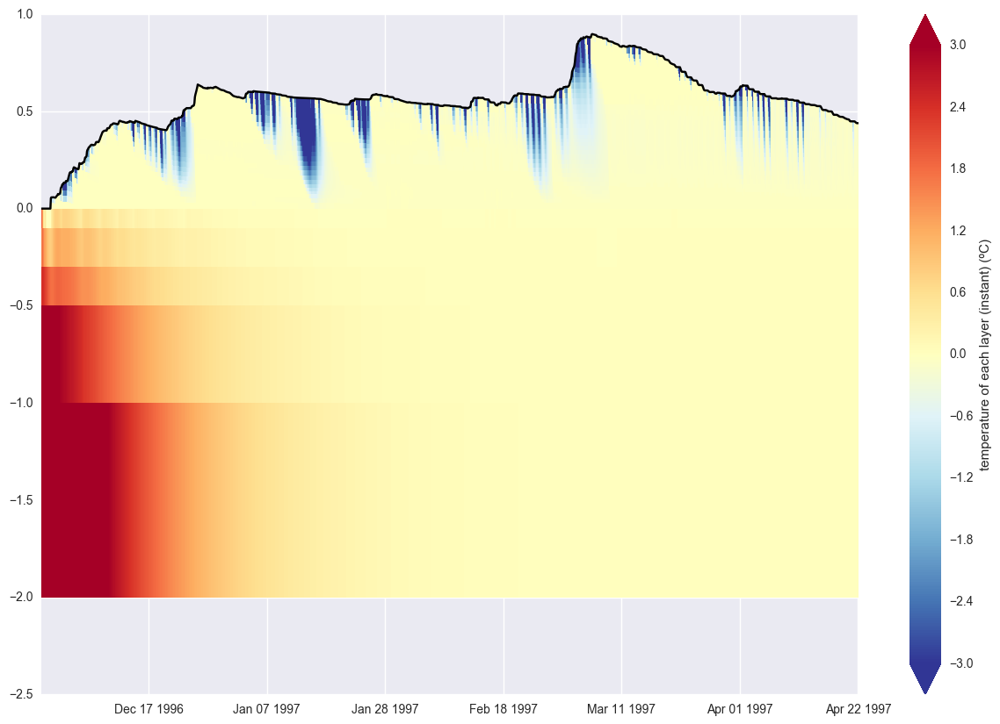

# SUMMA Output Files

<a id="outfile_file_formats"></a>
## Output file formats
All SUMMA output files are in [NetCDF format](SUMMA_input#infile_format_nc).

<a id="outfile_dimensions"></a>
## Output file dimensions
SUMMA output files can have the following dimensions (as defined in `build/source/netcdf/def_output.f90`). Dimensions may be present even in output files where they are not actually used. Most of these dimensions are pretty self-explanatory, except perhaps the `[mid|ifc][Snow|Soil|Toto]andTime` dimensions, which combine depth and time information as a work-around for the lack of support for variable-length or ragged arrays in earlier versions of NetCDF-4. While SUMMA will likely move to support these variable-length arrays in its output, we currently use a different organization. The dimensions indicated by `ifc` are associated with variables that are specified at the interfaces between layers including the very top and bottom. For example, the flux into or out of a layer would be arranged along an `ifc` dimension. The dimensions indicated by `mid` are associated with variables that are specified at the mid-point of each layer (or layer-average). `Snow`, `Soil`, and `Toto` indicate snow layers, soil layers, and all layers, respectively. This is explained in detail in the [model history file](#outfile_history) section.

| Dimension | long name | notes |
|-----------|-----------|-------|
| hru              | dimension for the HRUs | Variables and parameters that vary by HRU |
| depth            | dimension for soil depth | Variables and parameters that are defined for a fixed number of layers |
| scalar           | dimension for scalar variables | Scalar variables and parameters (degenerate dimension) |
| spectral_bands   | dimension for the number of spectral bands | Variables and parameters that vary for different spectral regimes |
| time             | dimension for the time step | Time-varying variables and parameters |
| timeDelayRouting | dimension for the time delay routing vectors | Variables and parameters that are held in memory as part of routing routines |
| midSnowAndTime   | dimension for midSnow-time | Time-varying variables and parameters at the mid-point of each snow layer |
| midSoilAndTime   | dimension for midSoil-time | Time-varying variables and parameters at the mid-point of each soil layer |
| midTotoAndTime   | dimension for midToto-time | Time-varying variables and parameters at the mid-point of each layer in the combined soil and snow profile |
| ifcSnowAndTime   | dimension for ifcSnow-time | Time-varying variables and parameters at the interfaces between snow layers (including top and bottom) |
| ifcSoilAndTime   | dimension for ifcSoil-time | Time-varying variables and parameters at the interfaces between soil layers (including top and bottom) |
| ifcTotoAndTime   | dimension for ifcToto-time | Time-varying variables and parameters at the interfaces between all layers in the combined soil and snow profile (including top and bottom) |

<a id="outfile_restart"></a>
## Restart or state file
A SUMMA restart file is in [NetCDF forma](SUMMA_input#infile_format_nc) and is written by `build/source/netcdf/modelwrite.f90:writeRestart()`. This file is also an input file because it specifies the initial conditions at the start of a model simulation. It is described in more detail in the [SUMMA input](SUMMA_input#infile_initial_conditions) documentation. Note that when the file is written, the time for which it is valid is included as part of the model file name.

<a id="outfile_history"></a>
## Model history files
SUMMA history files are in [NetCDF format](SUMMA_input#infile_format_nc) and describe the time evolution of SUMMA variables and parameters. The files are written by the `writeParm`, `writeData`, `writeBasin`, and `writeTime` subroutines in `build/source/netcdf/modelwrite.f90`. SUMMA output is pretty flexible. You can output many time-varying model variables and parameters, including summary statistics. You can specify what you want to output in the  [output control file](SUMMA_input#infile_output_control), which is one of SUMMA's required input files.

The output is organized as a function of time and then as a function of the entire model domain, by GRU, and by HRU. For example, domain average scalar quantities such as `basin__SurfaceRunoff` are arranged along the `time` dimension only. Scalar quantities that vary by HRU will be arranged along both a `time` and `hru` dimension. This should be fairly self-explanatory.

Where it gets a bit more complicated is when describing model output that varies by model layer as a function of time (and perhaps also by HRU). In this case, the complication arises because SUMMA allows for a time-varying number of model layers. Thus, while it would make sense to organize the layer-specific information as (`time`, `hru`, `layer`), the varying size of the layer dimension would mean that the dimension would need to be oversized (thus wasting space), unless NetCDF allows for variable-length or ragged arrays. This was not possible in earlier versions of NetCDF, but NetCDF-4 added support for a [variable length array type](https://www.unidata.ucar.edu/software/netcdf/netcdf-4/newdocs/netcdf-c/Variable-Length-Array.html) albeit with some restrictions. SUMMA will likely move to support this at some point, but currently we arrange the output differently. All layer output is stored by concatenating the output from all the layers at successive time steps (along dimensions with names such as `midSnowAndTime` or `ifcTotoAndTime`). In essence, we combing the `time` and `layer` dimensions into a single one. Because the layer information can be laid end-to-end, there is less wasted space, but the downside is that it becomes more difficult to extract the information for a specific layer or for a specific profile from the history file. The user has to construct a vector of indices into the combined time and layer dimension to extract the information that they need.

To help retrieve or unpack the information stored along the `[mid|ifc][Snow|Soil|Toto]andTime` dimensions, SUMMA stores some additional information. We need information about the time-varying number of snow, soil and total layers and the history files store this information in the following variables

 * `nSnow` - time-varying number of snow layers
 * `nSoil` - time-varying number of soil layers
 * `nLayers` - time-varying number of total layers

We also we need to know where along the `[mid|ifc][Snow|Soil|Toto]andTime` dimension the information for a specific time step is stored. SUMMA stores this information in the variables

 * `ifcSnowStartIndex` (may not be present if there is no snow)
 * `ifcSoilStartIndex`
 * `ifcTotoStartIndex`
 * `midSnowStartIndex` (may not be present if there is no snow)
 * `midSoilStartIndex`
 * `midTotoStartIndex`

Note that these indices are 1-based, so if you are using python, C, or any other 0-based language, you'll need to substract 1 when you use these indices to index a variable arranged along a `[mid|ifc][Snow|Soil|Toto]andTime` dimension.

This information can now be used to extract the information you need. This may best be demonstrated with an example. For example, if you save the variable `mLayerVolFracWat` in the history file, then you'll find that this variable is arranged along the `midTotoAndTime` and `hru` dimensions in the NetCDF file
```
double mLayerVolFracWat(midTotoAndTime, hru)
```
If you want to extract the information for the first timestep then in pseudo-code you want to do something like this (assuming a 0-based language like python)

```Python
# Note that the following is not real code. Typing this into python will not work as-is
hru = 0 # python indices are 0-based, so this is the first hru
timestep = 0 # python indices are 0-based, so this is the first time step
layers = nLayers[timestep, hru] # extract the number of layers associated with the first timestep
startIndex = midTotoStartIndex[timestep, hru] - 1 # - 1 since the SUMMA indices are 1-based and python indices are 0-based
endIndex = startIndex + layers
moistureProfile = mLayerVolFracWat[startIndex:endIndex, hru] # moisture profile at the first timestep
```

To get the actual vertical locations (rather than just the vertical indices), you should also include `mLayerHeight` in the history file. Since this is arranged along the same dimension, you can extract the actual vertical locations (in m) as `mLayerHeight[startIndex:endIndex, hru]`.

You can combine these various forms of information to extract detailed information about SUMMA model output, such as the plot below which shows the time evolution of temperature in a SUMMA simulation in which there is a varying number of vertical layers because of snow accumulation and melt. Here `0.0` indicates the top of the soil layers. Negative numbers describe locations within the soil, while positive numbers indicate locations within the snow.

<a id="SUMMA_parameters_spec_order"></a>
*Time evolution of temperature in a simulation with a time varying number of snow layers.*
